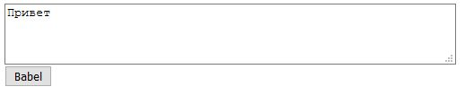

# babel
Makes Russian text untranslatable by converting the UTF-8 characters to visually equivalent alternatives.  For example Привет -> Πpивeт (try to Google Translate).

I made this for my wife so she can talk about American politics without pissing people off :)

You can check it out [here](https://babel-226202.uc.r.appspot.com/)

